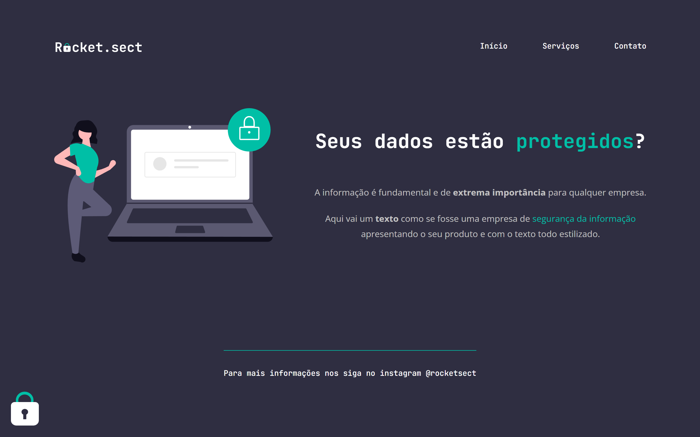

# Explorer Turma 6

>Desafio 01 construído no programa Explorer da Rocketseat

Projeto construído sem qualquer ajuda de professor, utilizando os conhecimentos adquiridos no módulo 2 do curso. 
Nos foi disponibilizado apenas o design no Figma da página.

## Tecnologias
HTML
CSS

## Contato
daniel.aretakis@hotmail.com
